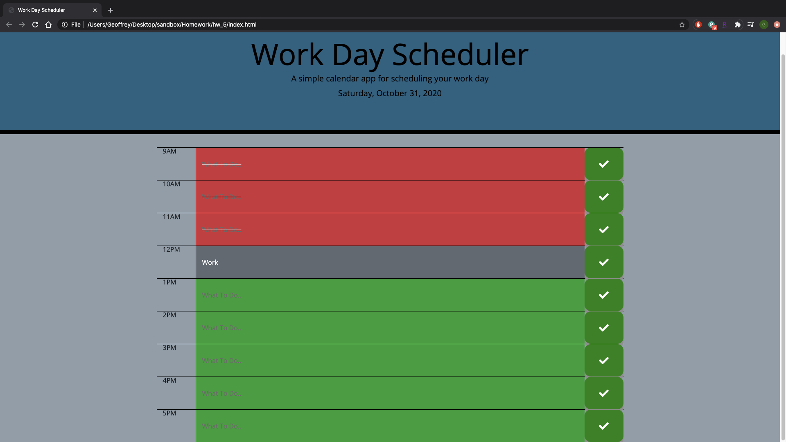

# 05 Third-Party APIs: Work Day Scheduler

In this project, we were to create a simple 9-5 work schedule. Users should be able to type and save their tasks in the alotted time slots. Javascript is to be used to check the time and show which tasks have been or need to be completed.

